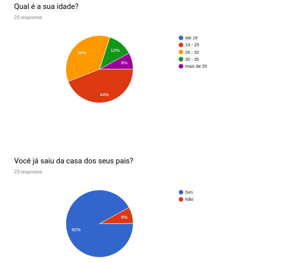
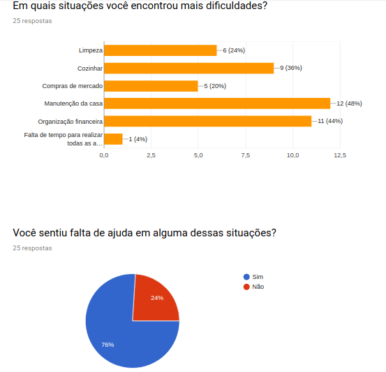
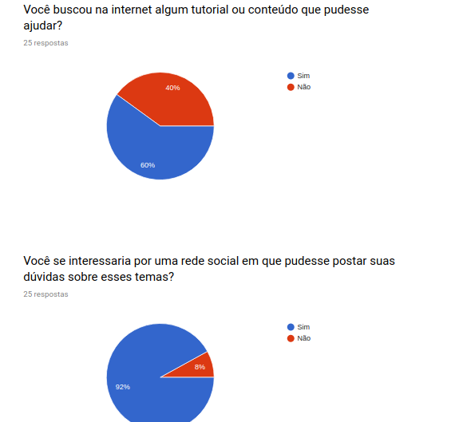
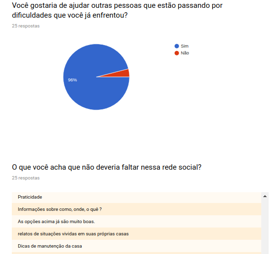
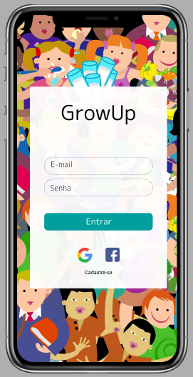
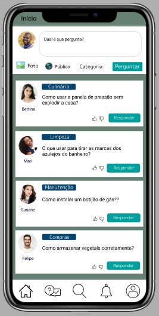

# Rede Social

Este projeto consiste em desenvolver uma rede social.
Rede social é uma plataforma que conecta pessoas para que elas possam interagir e compartilhar informações. Diversas pesquisas mostram que os brasileiros são grandes adeptos dessas redes.

De acordo com o relatório “Digital in 2018: The Americas”, divulgado pelas empresas We are Social e Hootsuite, foi constatado que 62% da população brasileira está ativa nas redes sociais. Também há outro relatório, do site We Are Social, que aponta que diariamente os brasileiros ficam em média 3h39 online e que o número de novos usuários em rede sociais só aumenta a cada ano.

# Grow Up
Clique [aqui](https://redesocial-6219f.firebaseapp.com/) para acessar.

Grow Up é uma rede social que tem como objetivo ajudar pessoas que saíram da casa dos pais há pouco tempo e foram morar sozinhas. Com essa rede social, elas postam dúvidas de problemas que estão enfrentando para que outros usuários que já passaram por esse problema possam ajudá-las. 
Sendo assim uma rede para dois tipos de usuários: aquele que está enfrentando dificuldades e aquele já passou pelo mesmo problema e tem conhecimento para ajudar.

### Personas

### Pesquisa

Segue resultado da pesquisa utilizada para identificar as necessidades dos usuários:

### Protótipo
[Protótipo](https://www.figma.com/proto/UWwRd46Mawe9coHzOR4pb8kZ/Login?node-id=3%3A2&scaling=scale-down)

### Testes

Com a realização dos testes do produto no HTML foi identificada a necessidade de realizar algumas alterações no layout para incluir todos as funcionalidades necessárias. Como por exemplo, a substituição de um botão de excluir e editar para um select com essas opções. Pois os usuários acharam que o post estava ficando muito “poluído” e também a criação de um botão de logout.

### Desenvolvimento
O projeto foi desenvolvido com JS, Bootstrap, Jquery e Firebase (database e hosting).

### Divulgação

Para divulgar o Grow Up foi pensado na estratégia de fechar parcerias com canais do Youtube de tutoriais e também em grupos de Facebook voltados para esse público.

